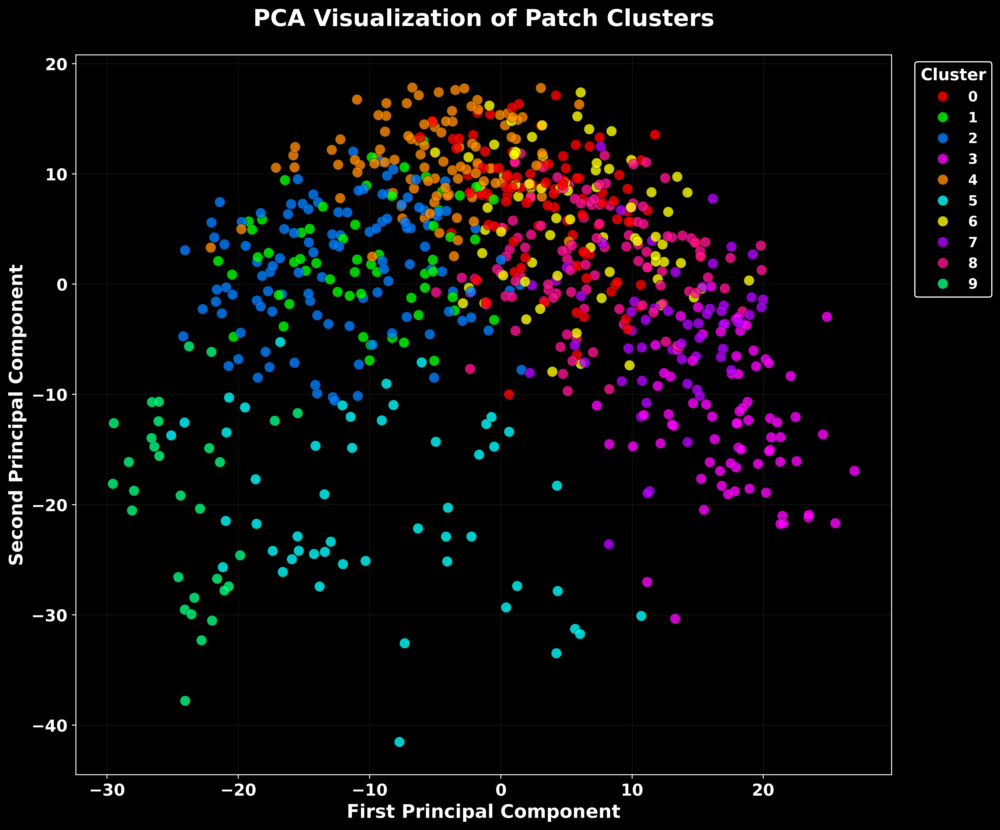

# vigseg

A Vision Transformer pipeline for unsupervised tissue-region discovery in kidney microscopy. It extracts multi-scale DINO ViT-S/16 embeddings from nuclei segmentation masks, clusters them with MiniBatchKMeans, and visualises the results as coloured overlays on the original tissue image.

**Author:** Christos Botos
**Affiliation:** Leiden University Medical Center (LUMC)
**Contact:** botoschristos@gmail.com | [LinkedIn](https://linkedin.com/in/christos-botos-2369hcty3396) | [GitHub](https://github.com/ChrisBotos)



---

## What it does

Given a high-resolution tissue image and a uint32 nuclei segmentation mask, vigseg:

1. **Filters** nuclei by morphological quality (area, circularity, solidity, eccentricity).
2. **Converts** the label map to a binary TIFF for ViT input.
3. **Extracts** DINO ViT-S/16 embeddings at multiple scales (16, 32, 64 px) per nucleus, fusing them into a single feature vector.
4. **Filters** features to keep only selected scales.
5. **Clusters** the fused embeddings and paints each nucleus with its cluster colour.

The output is a set of tissue-region labels (e.g. medulla vs cortex), not individual cell-type annotations.

---

## Installation

```bash
conda env create -f environment.yml
conda activate vitseg_310
pip install -e .
```

---

## Quick start

```bash
# Full pipeline (edit step flags at the top of pipeline.sh).
./pipeline.sh

# Or use the Python CLI.
vigseg --steps filter_masks binary vit_extraction filtering clustering

# Or run individual stages.
python -m vigseg.preprocessing.filter_masks --input masks/segmentation_masks.npy --results-dir results/
python -m vigseg.extraction.dynamic_patches_vit --image data/binary.tif --mask results/filtered_passed_labels.npy --label_map masks/segmentation_masks.npy --output results/ --patch_sizes 16 32 64 --save_numpy --no_compile
```

---

## Pipeline stages

```
segmentation_masks.npy
        │
        ▼
┌─────────────────────┐
│  1. filter_masks     │  Morphological QA (area, circularity, solidity, …)
└────────┬────────────┘
         ▼
┌─────────────────────┐
│  2. binary_conversion│  Label map → 8-bit binary TIFF
└────────┬────────────┘
         ▼
┌─────────────────────┐
│  3. dynamic_patches  │  Per-nucleus crops → DINO ViT-S/16 → fused embeddings
│     _vit             │  (16 px + 32 px + 64 px, discriminative weighting)
└────────┬────────────┘
         ▼
┌─────────────────────┐
│  4. filter_features  │  Keep only selected scales (e.g. 16 + 32 px)
└────────┬────────────┘
         ▼
┌─────────────────────┐
│  5. cluster_dynamic  │  MiniBatchKMeans → PCA scatter + coloured overlay
│     _patches         │
└─────────────────────┘
```

---

## Project structure

```
vigseg/
├── src/vigseg/           # Main package (pip-installable)
│   ├── cli.py            # CLI entry point
│   ├── preprocessing/    # Stages 1-2: mask filtering, binary conversion
│   ├── extraction/       # Stage 3:  ViT embedding extraction
│   ├── clustering/       # Stages 4-5: feature filtering, clustering
│   ├── visualization/    # Overlay, crop, circle plots
│   ├── comparison/       # Cluster comparison vs spatial transcriptomics
│   └── utilities/        # Colour generation, spatial alignment, etc.
├── tests/                # pytest test suite
├── pipeline.sh           # Bash pipeline wrapper
├── pyproject.toml        # Package metadata
├── environment.yml       # Conda environment (Python 3.10)
└── CLAUDE.md             # Development instructions
```

---

## Configuration

Key parameters in `pipeline.sh`:

| Parameter | Default | Description |
|-----------|---------|-------------|
| `PATCH_SIZES` | `16 32 64` | Multi-scale crop sizes in pixels |
| `FILTER_BOX_SIZES` | `16 32` | Scales to keep after filtering |
| `K_INIT` | `10` | Number of clusters |
| `BATCH_SIZE` | `2048` | GPU batch size for ViT extraction |
| `MIN_PIXELS` / `MAX_PIXELS` | `20` / `900` | Nucleus area bounds |
| `MIN_CIRCULARITY` | `0.56` | Minimum circularity threshold |
| `MIN_SOLIDITY` | `0.765` | Minimum solidity threshold |
| `SEED` | `0` | Random seed for reproducibility |

---

## Testing

```bash
pytest tests/ -v    # 96 tests
```

GPU-dependent tests are skipped automatically when no CUDA device is available.

---

## Known limitations

### Methodological

- Identifies **tissue regions** (medulla vs cortex), not individual cell types.
- Clustering uses **MiniBatchKMeans only** — no hierarchical, spectral, or density-based alternatives.
- Features are extracted from **binary masks**, not H&E-stained images, discarding colour and texture information.
- Comparison with spatial transcriptomics yields **low agreement** (ARI ~0.01, NMI ~0.03), consistent with morphology and gene expression capturing different biological signals.
- No UMAP or t-SNE dimensionality reduction; only PCA is used for visualisation.

### Uniform tiling mode

- Uses **CLS token only** (384-D) vs dynamic patches using all patch tokens (384-D per scale).
- **No feature normalisation** before fusion.
- Contains coordinate origin bugs that can shift tile positions.
- Considered experimental; dynamic patches mode is the primary extraction method.

### Technical

- Spatial matching between ViT and transcriptomics uses **O(n*m)** brute-force pairing.
- Some code duplication between `cluster_dynamic_patches` and `cluster_uniform_tiles`.
- Auto-downsampling in clustering can silently reduce overlay resolution on large images.
- Requires **pre-computed uint32 segmentation masks** (e.g. from StarDist or Cellpose).

---

## Scientific context

This tool was developed for studying **Ischemia/Reperfusion Kidney Injury** at three time points (10 h, 2 days, 14 days) plus sham controls. It uses self-supervised DINO ViT-S/16 embeddings to discover morphological tissue patterns without manual annotation, and compares them against Visium spatial transcriptomics clusters.

---

## Citation

```bibtex
@software{botos2025vigseg,
  author = {Botos, Christos},
  title  = {vigseg: Vision Transformer Analysis of Kidney Tissue Segmentation Masks},
  year   = {2025},
  url    = {https://github.com/ChrisBotos/vigseg}
}
```
